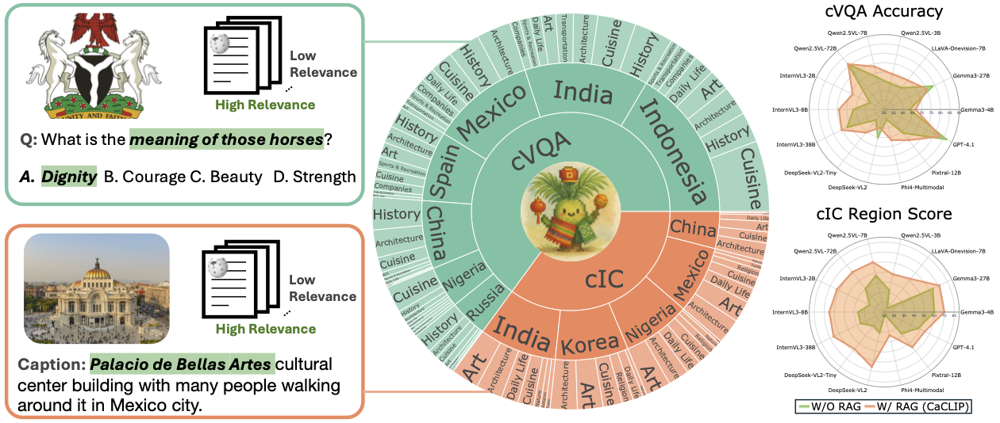

# RAVENEA: A Benchmark for Multimodal Retrieval-Augmented Visual Culture Understanding
<div align="center">
<a href="https://jiaangli.github.io/RAVENEA/" target="_blank"></a>
<a href="https://arxiv.org/abs/2505.14462" target="_blank"></a>
<a href="https://huggingface.co/datasets/jaagli/ravenea" target="_blank"></a>
</div>
<p align="center">
  
</p>

## Overview
We introduce RAVENEA, a large-scale benchmark comprising over 10,000 human-ranked Wikipedia documents tailored for culture-aware vision-language understanding. The dataset spans eight countries and eleven diverse topical categories, and includes more than 1,800 culturally grounded images. Our experiments demonstrate that retrieval-based cultural augmentation improves performance of lightweight vision-language models by 3.2% on culture-aware VQA (cVQA) and 6.2% on culture-aware image captioning (cIC), underscoring the importance of RAG in cultural context in multimodal learning.
<p align="center">
  
</p>


## Getting Started
### Installation
Install the dependencies with 
```sh
pip install -r requirements.txt
```
### Examples
Load the dataset.
```python
from datasets import load_dataset

data = load_dataset("jaagli/ravenea", split="combination")
```
Evaluate the clip model with retrieval metrics
```sh
python ./src/ret_baseline.py --model_id openai/clip-vit-large-patch14
```
Evaluate the without RAG on downstream tasks
```sh
python ./example/example.py --model-type deepseek_vl_v2 --model-id deepseek-ai/deepseek-vl2-tiny \
    --modality image \
    --use_different_prompt_per_request \
    --num-prompts 0 \
    --top-k-retrieval 1 \
    --dataset jaagli/ravenea \
```
Evaluate the with RAG on downstream tasks
```sh
# Get the RAG results
python ./src/ret_baseline.py --model_id openai/clip-vit-large-patch14

# Use the RAG results
python ./example/example.py --model-type deepseek_vl_v2 --model-id deepseek-ai/deepseek-vl2-tiny \
    --modality image \
    --use_different_prompt_per_request \
    --num-prompts 0 \
    --top-k-retrieval 1 \
    --dataset jaagli/ravenea \
    --use-retrieval \
    --retrieval-file ./models/baselines/clip-vit-large-patch14.csv
```


## Citation
If you find RAVENEA helpful, please consider citing our [paper](https://arxiv.org/abs/2505.14462).
```bibtex
@misc{li2025raveneabenchmarkmultimodalretrievalaugmented,
      title={RAVENEA: A Benchmark for Multimodal Retrieval-Augmented Visual Culture Understanding}, 
      author={Jiaang Li and Yifei Yuan and Wenyan Li and Mohammad Aliannejadi and Daniel Hershcovich and Anders Søgaard and Ivan Vulić and Wenxuan Zhang and Paul Pu Liang and Yang Deng and Serge Belongie},
      year={2025},
      eprint={2505.14462},
      archivePrefix={arXiv},
      primaryClass={cs.CV},
      url={https://arxiv.org/abs/2505.14462}, 
}
```